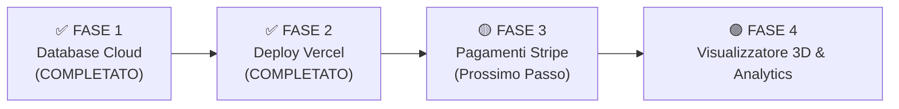

# MANUALE ADMIN & GUIDA OPERATIVA — SMART TOONS
> **Versione Documento:** 2.0 (ONLINE SU VERCEL E SUPABASE CLOUD)  
> **Ultimo Aggiornamento:** 26 Settembre 2026  
> **Percorso Progetto:** `E:\Desktop PcMarco\ClaudeAI\SmartToon`  
> **Repository GitHub:** `https://github.com/MarcoM1984/smarttoon`

---

## 📌 INTRODUZIONE
Questo manuale descrive passo-passo come attivare, configurare ed utilizzare l'applicazione **Smart Toons**. Il documento viene costantemente aggiornato ad ogni nuova funzionalità o modifica dell'applicazione.

Smart Toons è una piattaforma web (PWA) che collega un personaggio 3D personalizzato (Minitoon o Microtoon) a un **Profilo Digitale NFC / QR Code**.

---

## 🟢 STATO ATTUALE: ONLINE SU INTERNET VIA VERCEL!

Le **FASE 1 e FASE 2 della Roadmap sono state completate con successo!** L'applicazione è ora pubblicata live su Vercel in HTTPS ed è collegata al database Cloud Supabase.

* ✅ Tabelle `profiles` e `toons` live su Supabase Cloud (`kaehhbuwxfrqvhfagddf.supabase.co`).
* ✅ Codice salvato e protetto nel repository GitHub (`MarcoM1984/smarttoon`).
* ✅ **Deploy Automatico su Vercel:** Ogni volta che facciamo una modifica al codice, Vercel aggiorna il sito live in 5 secondi!

---

## 🚀 ROADMAP OPERATIVA DI OTTIMIZZAZIONE & GO-LIVE

### ✅ FASE 1: Database Cloud (COMPLETATO)
- [x] Creare il progetto su Supabase Cloud.
- [x] Eseguire lo script SQL per creare le tabelle `profiles` e `toons`.
- [x] Sincronizzare Profilo Pubblico, Area Cliente e Pannello Admin con Supabase.

### ✅ FASE 2: Deploy su Vercel e Github (COMPLETATO)
- [x] Collegare il progetto al repository GitHub `MarcoM1984/smarttoon`.
- [x] Connettere GitHub a **Vercel** con deployment automatico HTTPS.
- [x] Sincronizzare le variabili d'ambiente Supabase in Vercel.

### 🟡 FASE 3: E-commerce & Pagamenti Automatici (Prossimo Passo - 2 Giorni)
- [ ] Integrare **Stripe Checkout** per l'acquisto di *Minitoon Smart Card* e *Microtoon Smartphone Edition*.
- [ ] Creazione automatica dell'ordine `ST-XXXXXX` a pagamento completato.
- [ ] Invio email automatiche di conferma e notifica avanzamento lavorazione.

### 🟣 FASE 4: Ottimizzazioni Avanzate & Funzionalità Pro (Fase 2)
- [ ] **Viewer 3D Interattivo 360°:** Integrazione di Three.js nell'area cliente per ruotare il personaggio 3D nello spazio prima di approvarlo.
- [ ] **Statistiche TAP NFC per il Cliente:** Tracciamento di quante volte la card/gadget è stata scansionata con grafico nell'area cliente.

---

## 🌐 MAPPA DELLE ROTTE DELL'APPLICAZIONE

| Sezione | URL | Descrizione |
| :--- | :--- | :--- |
| **Homepage & Simulatore** | `https://smarttoon-app.vercel.app/` | Presentazione dei prodotti e pulsanti rapidi per simulare l'esperienza. |
| **Profilo Pubblico NFC / QR** | `https://smarttoon-app.vercel.app/t/ST-000125` | La pagina di destinazione legata a Supabase che si apre su smartphone facendo il *TAP* NFC. |
| **Area Riservata Cliente** | `https://smarttoon-app.vercel.app/account` | Area dove il cliente modifica i propri dati su Supabase Cloud, carica le foto e approva il render 3D. |
| **Pannello Amministratore** | `https://smarttoon-app.vercel.app/admin` | Dashboard per gestire il flusso degli ordini e assegnare i Tag NFC in tempo reale. |

---

## 🛠️ GUIDA OPERATIVA ALL'USO

### A. Profilo Pubblico NFC / QR (`/t/[id]`)
* **Come testare il TAP NFC su smartphone vero:** Apri dal tuo telefono il link pubblico Vercel (es. `/t/ST-000125`).
* **Download Contatto in Rubrica:** Clicca su **"Salva Contatto in Rubrica"** per scaricare la vCard (`.vcf`).

### B. Area Riservata Cliente (`/account`)
* **Salvataggio su Cloud:** Quando modifichi un numero di telefono o la Bio e clicchi *"Salva Modifiche"*, il dato viene aggiornato nel database Supabase.

### C. Pannello Amministratore (`/admin`)
* **Gestione Lavorazione & NFC:** Aggiorna lo stato dell'ordine, assegna l'UID del chip NFC e inserisci l'URL del render 3D.

---

## 📝 REGISTRO DELLE MODIFICHE (CHANGELOG)

### Versione 2.0 (26/09/2026)
* 🚀 **Vercel Deployment Live:** L'applicazione è ufficialmente online su Vercel con SSL/HTTPS e CI/CD da GitHub.
* 📦 Collegamento al repository GitHub `MarcoM1984/smarttoon`.

### Versione 1.2 (26/09/2026)
* 🚀 **Supabase Cloud Live:** Collegamento completo dell'applicazione al database remoto Supabase.

### Versione 1.0 (26/09/2026)
* ✅ Inizializzazione del progetto Next.js 14 con TypeScript e Tailwind CSS.
