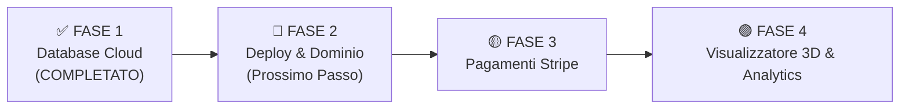

# MANUALE ADMIN & GUIDA OPERATIVA — SMART TOONS
> **Versione Documento:** 1.2 (Supabase Cloud Collegato ed Operativo)  
> **Ultimo Aggiornamento:** 26 Settembre 2026  
> **Percorso Progetto:** `E:\Desktop PcMarco\ClaudeAI\SmartToon`

---

## 📌 INTRODUZIONE
Questo manuale descrive passo-passo come attivare, configurare ed utilizzare l'applicazione **Smart Toons**. Il documento viene costantemente aggiornato ad ogni nuova funzionalità o modifica dell'applicazione.

Smart Toons è una piattaforma web (PWA) che collega un personaggio 3D personalizzato (Minitoon o Microtoon) a un **Profilo Digitale NFC / QR Code**.

---

## 🟢 STATO ATTUALE: SUPABASE CLOUD OPERATIVO!

La **FASE 1 della Roadmap è stata completata con successo**. L'applicazione legge e scrive in tempo reale sul tuo database Postgres Cloud di Supabase (`kaehhbuwxfrqvhfagddf.supabase.co`).

* ✅ Tabelle `profiles` e `toons` create su Supabase.
* ✅ Profilo Demo **Marco Marrazzo (`ST-000125`)** creato nel Cloud.
* ✅ L'Area Cliente e il Pannello Admin aggiornano il Cloud in tempo reale.

---

## 🚀 ROADMAP OPERATIVA DI OTTIMIZZAZIONE & GO-LIVE

### ✅ FASE 1: Database Cloud (COMPLETATO)
- [x] Creare il progetto su Supabase Cloud.
- [x] Eseguire lo script SQL per creare le tabelle `profiles` e `toons`.
- [x] Collegare la chiave Publishable nel file `.env.local`.
- [x] Sincronizzare Profilo Pubblico, Area Cliente e Pannello Admin con Supabase.

### 🔵 FASE 2: Deploy su Vercel e Dominio Custom (Prossimo Passo - 1 Ora)
- [ ] Collegare la cartella del progetto ad un repository GitHub.
- [ ] Connettere GitHub a **Vercel** per avere il deployment automatico HTTPS gratuito.
- [ ] Associare il dominio (es. `smarttoons.it`).
- [ ] Testare l'URL pubblico reale su smartphone reale tramite scansione QR Code.

### 🟡 FASE 3: E-commerce & Pagamenti Automatici (2 Giorni)
- [ ] Integrare **Stripe Checkout** per l'acquisto di *Minitoon Smart Card* e *Microtoon Smartphone Edition*.
- [ ] Creazione automatica dell'ordine `ST-XXXXXX` a pagamento completato.
- [ ] Invio email automatiche di conferma e notifica avanzamento lavorazione.

### 🟣 FASE 4: Ottimizzazioni Avanzate & Funzionalità Pro (Fase 2)
- [ ] **Viewer 3D Interattivo 360°:** Integrazione di Three.js nell'area cliente per ruotare il personaggio 3D nello spazio prima di approvarlo.
- [ ] **Statistiche TAP NFC per il Cliente:** Tracciamento di quante volte la card/gadget è stata scansionata con grafico nell'area cliente.

---

## 🌐 MAPPA DELLE ROTTE DELL'APPLICAZIONE

| Sezione | URL Locale | Descrizione |
| :--- | :--- | :--- |
| **Homepage & Simulatore** | `http://localhost:3000/` | Presentazione dei prodotti e pulsanti rapidi per simulare l'esperienza. |
| **Profilo Pubblico NFC / QR** | `http://localhost:3000/t/ST-000125` | La pagina di destinazione legata a Supabase che si apre su smartphone facendo il *TAP* NFC. |
| **Area Riservata Cliente** | `http://localhost:3000/account` | Area dove il cliente modifica i propri dati su Supabase Cloud, carica le foto e approva il render 3D. |
| **Pannello Amministratore** | `http://localhost:3000/admin` | Dashboard per gestire il flusso degli ordini e assegnare i Tag NFC in tempo reale. |

---

## 🛠️ GUIDA OPERATIVA ALL'USO

### A. Profilo Pubblico NFC / QR (`/t/[id]`)
* **Come testare il TAP NFC:** Apri la pagina `/t/ST-000125`. I dati vengono recuperati direttamente da Supabase Cloud!
* **Download Contatto in Rubrica:** Clicca su **"Salva Contatto in Rubrica"** per scaricare la vCard (`.vcf`).

### B. Area Riservata Cliente (`/account`)
* **Salvataggio su Cloud:** Quando modifichi un numero di telefono o il nome dall'Area Cliente e clicchi *"Salva Modifiche"*, il dato viene aggiornato sul database Supabase!

### C. Pannello Amministratore (`/admin`)
* **Gestione Avanzamento Lavorazione:** Cliccando sugli stati dell'ordine o cambiando l'UID del chip NFC, il database Cloud si aggiorna immediatamente.

---

## 📝 REGISTRO DELLE MODIFICHE (CHANGELOG)

### Versione 1.2 (26/09/2026)
* 🚀 **Supabase Cloud Live:** Collegamento completo dell'applicazione al database remoto Supabase.
* ⚡ Sincronizzazione in tempo reale di Profilo Pubblico, Area Cliente e Pannello Admin.

### Versione 1.1 (26/09/2026)
* 📑 Aggiunta la sezione **Cosa Manca per essere Operativi** e la **Roadmap di Ottimizzazione a 4 Fasi**.
* 🛠️ Corretta e ottimizzata la gestione delle metatag Viewport in Next.js 14.

### Versione 1.0 (26/09/2026)
* ✅ Inizializzazione del progetto Next.js 14 con TypeScript e Tailwind CSS.
* ✅ Creazione del sistema di generazione vCard (.vcf) nativo.
* ✅ Realizzazione del Profilo Pubblico NFC (`/t/[id]`).
* ✅ Realizzazione dell'Area Riservata Cliente (`/account`).
* ✅ Realizzazione del Pannello Amministratore (`/admin`).
* ✅ Redazione del Manuale Admin Operativo (`MANUALE_ADMIN_SMARTTOON.md`).
